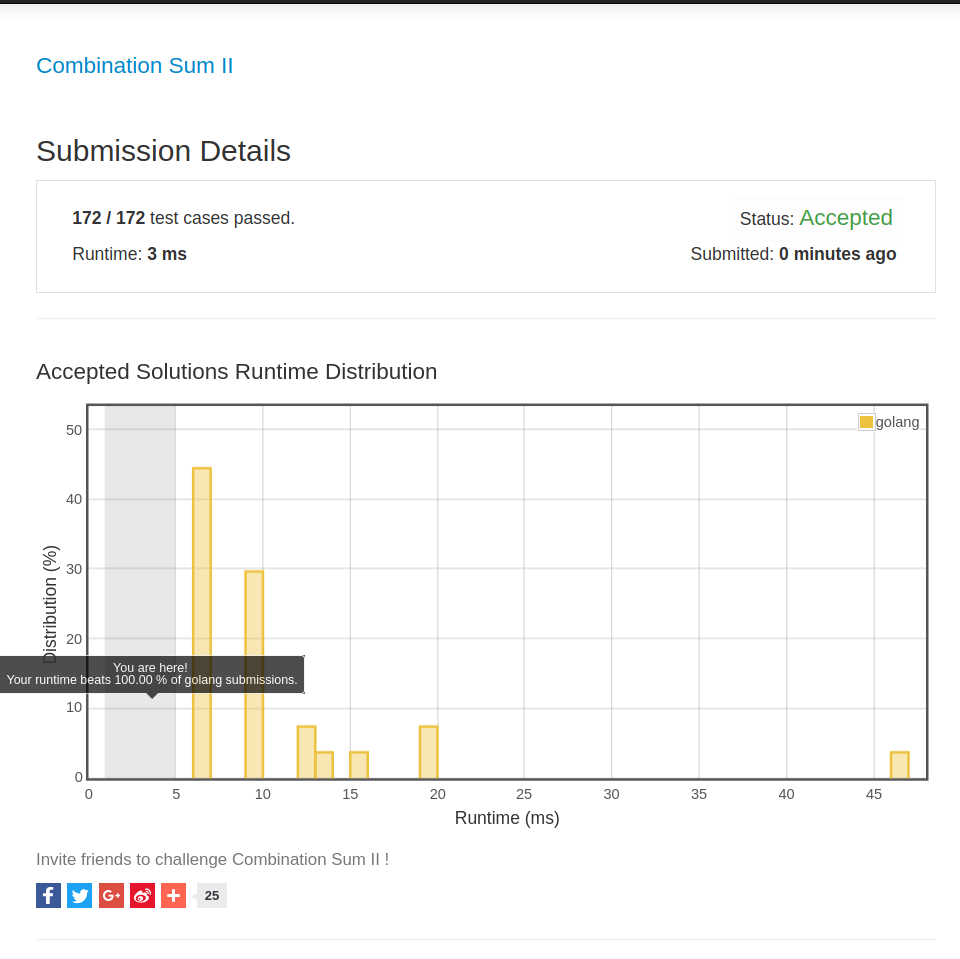

# [40. Combination Sum II](https://leetcode.com/problems/combination-sum-ii/)

## 题目
Given a collection of candidate numbers (C) and a target number (T), find all unique combinations in C where the candidate numbers sums to T.

Each number in C may only be used once in the combination.

Note:
1. All numbers (including target) will be positive integers.
1. The solution set must not contain duplicate combinations.
For example, given candidate set [10, 1, 2, 7, 6, 1, 5] and target 8, 
A solution set is:
``` 
[
  [1, 7],
  [1, 2, 5],
  [2, 6],
  [1, 1, 6]
]
```
## 解题思路
这一题是[39. Combination Sum](https://leetcode.com/problems/combination-sum/)的变种。区别在于，元素不能重复使用。所以在划分的时候，对candidates的处理也不同。

## 总结
又提交了一次，一不小心就迎来了人生的第一个100%，主要的功劳在leetcode服务器。

