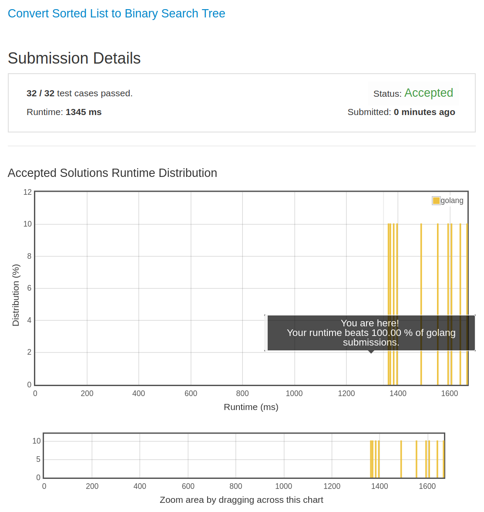

# [109-100%.png. Convert Sorted List to Binary Search Tree](https://leetcode.com/problems/convert-sorted-list-to-binary-search-tree/)

## 题目
Given a singly linked list where elements are sorted in ascending order, convert it to a height balanced BST.

## 解题思路

见程序注释

又见 100% ，感谢 LeetCode 服务器。

