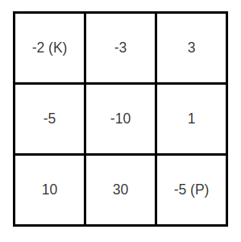

# [174. Dungeon Game](https://leetcode.com/problems/dungeon-game/)

## 题目

The demons had captured the princess (P) and imprisoned her in the bottom-right corner of a dungeon. The dungeon consists of M x N rooms laid out in a 2D grid. Our valiant knight (K) was initially positioned in the top-left room and must fight his way through the dungeon to rescue the princess.

The knight has an initial health point represented by a positive integer. If at any point his health point drops to 0 or below, he dies immediately. 

Some of the rooms are guarded by demons, so the knight loses health (negative integers) upon entering these rooms; 

other rooms are either empty (0's) or contain magic orbs that increase the knight's health (positive integers).

In order to reach the princess as quickly as possible, the knight decides to move only rightward or downward in each step. 

Write a function to determine the knight's minimum initial health so that he is able to rescue the princess.

For example, given the dungeon below, the initial health of the knight must be at least 7 if he follows the optimal path `RIGHT-> RIGHT -> DOWN -> DOWN`.



Notes:
- The knight's health has no upper bound.
- Any room can contain threats or power-ups, even the first room the knight enters and the bottom-right room where the princess is imprisoned.  

## 解题思路
在走完最后一个房间的时候血量至少要剩下１，因此最后的状态可以当成是初始状态，由后往前依次决定在每一个位置至少要有多少血量, 这样一个位置的状态是由其下面一个和和左边一个的较小状态决定 ．因此一个基本的状态方程是:
```
dp[i][j] + dungeon[i][j] = min(dp[i+1][j], dp[i][j+1]) 
```
但是还有一个条件就是在每一个状态必须血量都要大于１，因此我们还需要一个方程在保证在每一个状态都大于１，即：dp[i][j] = max(dp[i][j], 1);　也就是说虽然当前的血量到最后能够剩下１，但是现在已经低于１了，我们需要为其提升血量维持每一个状态至少都为１．

见程序注释

再次感谢 LeetCode 服务器
