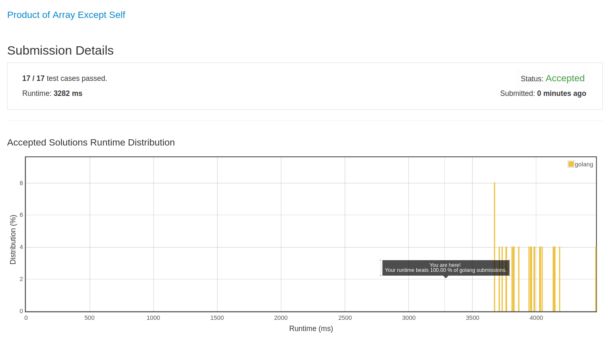

# [238. Product of Array Except Self](https://leetcode.com/problems/product-of-array-except-self/)

## 题目

Given an array of n integers where n > 1, nums, return an array output such that output[i] is equal to the product of all the elements of nums except nums[i].

Solve it without division and in O(n).

For example, given [1,2,3,4], return [24,12,8,6].

Follow up:
Could you solve it with constant space complexity? (Note: The output array does not count as extra space for the purpose of space complexity analysis.)

## 解题思路

见程序注释

有一个 100%，主要还是服务器的功劳，因为我同样的程序再提交一次，就只有 40%了。

