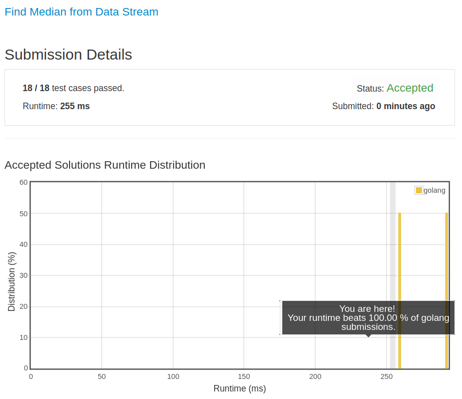

# [295. Find Median from Data Stream](https://leetcode.com/problems/find-median-from-data-stream/)

## 题目

Median is the middle value in an ordered integer list. If the size of the list is even, there is no middle value. So the median is the mean of the two middle value.

Examples:

```text
[2,3,4] , the median is 3
[2,3], the median is (2 + 3) / 2 = 2.5
```

Design a data structure that supports the following two operations:

- void addNum(int num) - Add a integer number from the data stream to the data structure.
- double findMedian() - Return the median of all elements so far.

For example:

```text
addNum(1)
addNum(2)
findMedian() -> 1.5
addNum(3)
findMedian() -> 2
```

Credits:Special thanks to @Louis1992 for adding this problem and creating all test cases.

## 解题思路

见程序注释

感谢 LeetCode 服务器

