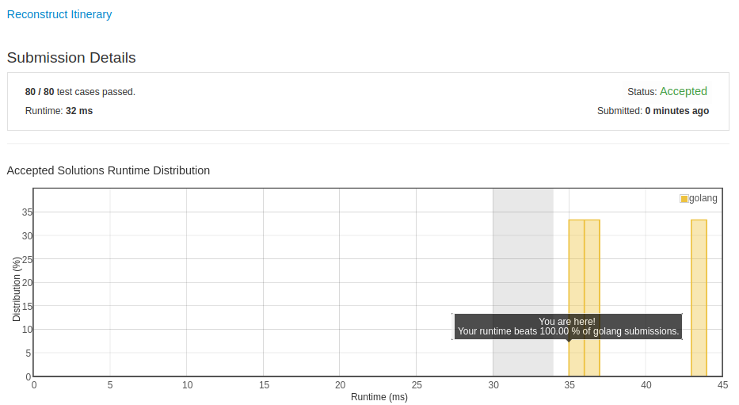

# [332. Reconstruct Itinerary](https://leetcode.com/problems/reconstruct-itinerary/)

## 题目

Given a list of airline tickets represented by pairs of departure and arrival airports [from, to], reconstruct the itinerary in order. All of the tickets belong to a man who departs from JFK. Thus, the itinerary must begin with JFK.

Note:

1. If there are multiple valid itineraries, you should return the itinerary that has the smallest lexical order when read as a single string. For example, the itinerary ["JFK", "LGA"] has a smaller lexical order than ["JFK", "LGB"].
1. All airports are represented by three capital letters (IATA code).
1. You may assume all tickets form at least one valid itinerary.

```text
Example 1:
tickets = [["MUC", "LHR"], ["JFK", "MUC"], ["SFO", "SJC"], ["LHR", "SFO"]]
Return ["JFK", "MUC", "LHR", "SFO", "SJC"].

Example 2:
tickets = [["JFK","SFO"],["JFK","ATL"],["SFO","ATL"],["ATL","JFK"],["ATL","SFO"]]
Return ["JFK","ATL","JFK","SFO","ATL","SFO"].
Another possible reconstruction is ["JFK","SFO","ATL","JFK","ATL","SFO"]. But it is larger in lexical order.
```

Credits:Special thanks to @dietpepsi for adding this problem and creating all test cases.

## 解题思路

见程序注释

