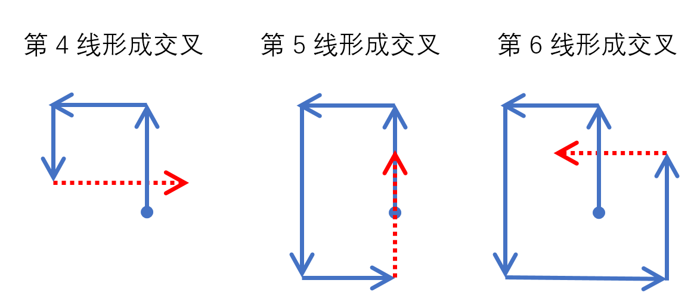
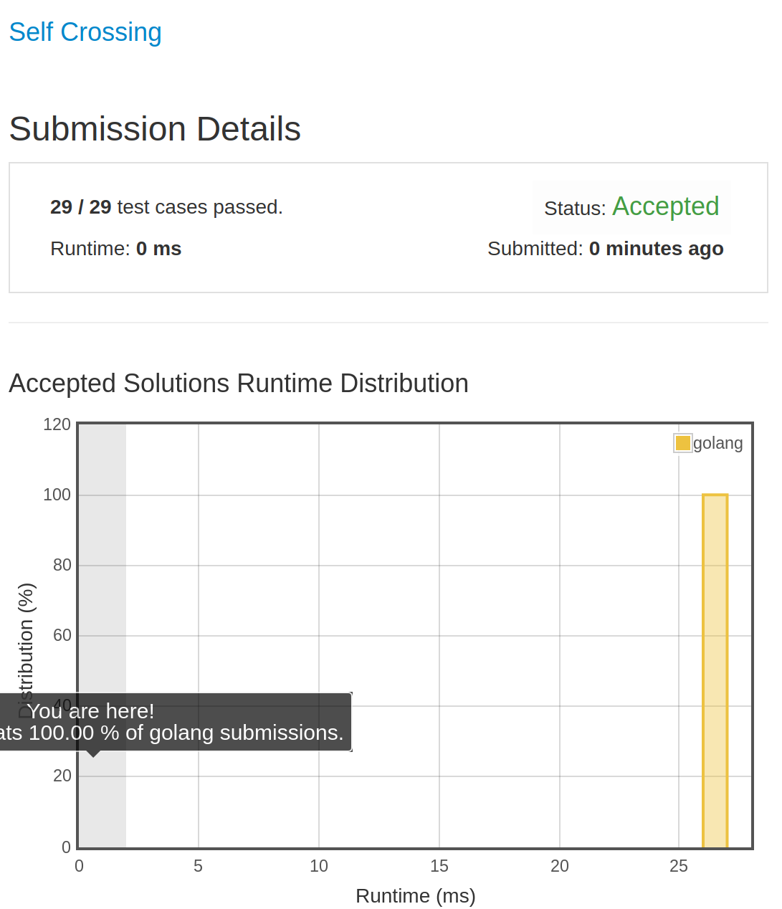

# [335. Self Crossing](https://leetcode.com/problems/self-crossing/)

## 题目

You are given an array x of n positive numbers. You start at point (0,0) and moves x[0] metres to the north, then x[1] metres to the west, x[2] metres to the south, x[3] metres to the east and so on. In other words, after each move your direction changes counter-clockwise.

Write a one-pass algorithm with O(1) extra space to determine, if your path crosses itself, or not.

Example 1:
Given x = [2, 1, 1, 2],
?????
?   ?
???????>
    ?

Return true (self crossing)

Example 2:
Given x = [1, 2, 3, 4],
????????
?      ?
?
?
?????????????>

Return false (not self crossing)

Example 3:
Given x = [1, 1, 1, 1],
?????
?   ?
?????>

Return true (self crossing)

Credits:Special thanks to @dietpepsi for adding this problem and creating all test cases.

## 解题思路

见程序注释
只会出现下面三种情况

