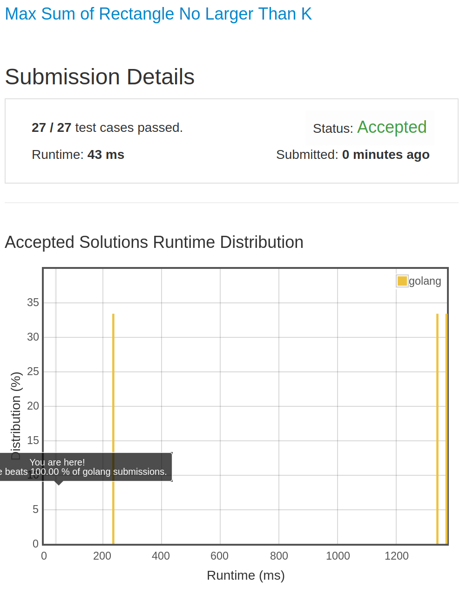

# [363. Max Sum of Rectangle No Larger Than K](https://leetcode.com/problems/max-sum-of-rectangle-no-larger-than-k/)

## 题目

Given a non-empty 2D matrix matrix and an integer k, find the max sum of a rectangle in the matrix such that its sum is no larger than k.

Example:

```text
Given matrix = [
  [1,  0, 1],
  [0, -2, 3]
]
k = 2
```

The answer is 2. Because the sum of rectangle [[0, 1], [-2, 3]] is 2 and 2 is the max number no larger than k (k = 2).

Note:

1. he rectangle inside the matrix must have an area > 0.
1. hat if the number of rows is much larger than the number of columns?

Credits:Special thanks to @fujiaozhu for adding this problem and creating all test cases.

## 解题思路

见程序注释

