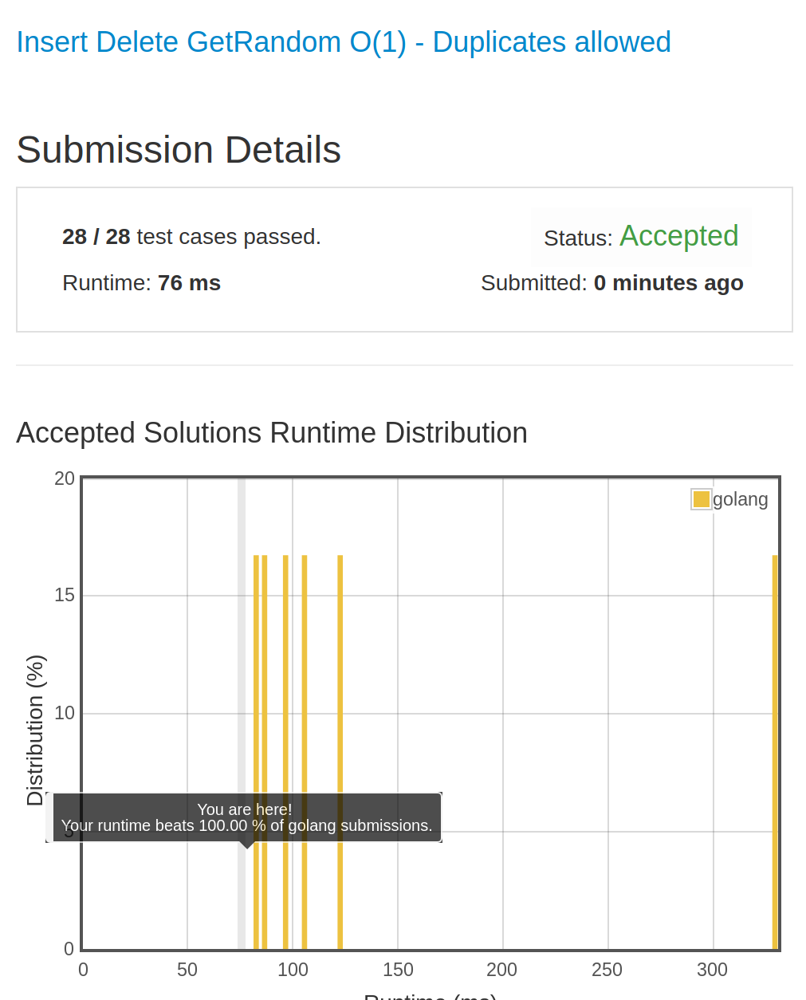

# [381. Insert Delete GetRandom O(1) - Duplicates allowed](https://leetcode.com/problems/insert-delete-getrandom-o1-duplicates-allowed/)

## 题目
Design a data structure that supports all following operations in average O(1) time.
Note: Duplicate elements are allowed.

1. insert(val): Inserts an item val to the collection.
1. remove(val): Removes an item val from the collection if present.
1. getRandom: Returns a random element from current collection of elements. The probability of each element being returned is linearly related to the number of same value the collection contains.


Example:
```
// Init an empty collection.
RandomizedCollection collection = new RandomizedCollection();

// Inserts 1 to the collection. Returns true as the collection did not contain 1.
collection.insert(1);

// Inserts another 1 to the collection. Returns false as the collection contained 1. Collection now contains [1,1].
collection.insert(1);

// Inserts 2 to the collection, returns true. Collection now contains [1,1,2].
collection.insert(2);

// getRandom should return 1 with the probability 2/3, and returns 2 with the probability 1/3.
collection.getRandom();

// Removes 1 from the collection, returns true. Collection now contains [1,2].
collection.remove(1);

// getRandom should return 1 and 2 both equally likely.
collection.getRandom();
```
## 解题思路

见程序注释

感谢 LeetCode 服务器，又多了一个100%
