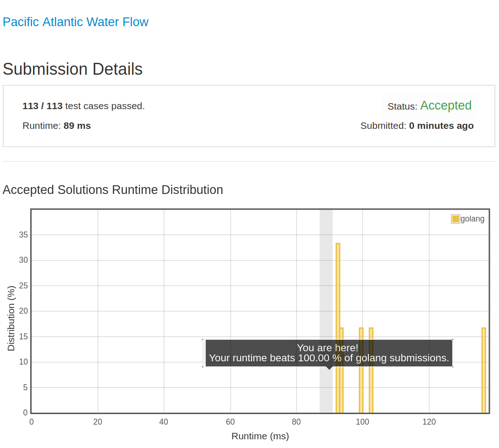

# [417. Pacific Atlantic Water Flow](https://leetcode.com/problems/pacific-atlantic-water-flow/)

## 题目

Given an m x n matrix of non-negative integers representing the height of each unit cell in a continent, the "Pacific ocean" touches the left and top edges of the matrix and the "Atlantic ocean" touches the right and bottom edges.

Water can only flow in four directions (up, down, left, or right) from a cell to another one with height equal or lower.

Find the list of grid coordinates where water can flow to both the Pacific and Atlantic ocean.

Note:

1. The order of returned grid coordinates does not matter.
1. Both m and n are less than 150.

Example:

```text
Given the following 5x5 matrix:

  Pacific ~   ~   ~   ~   ~
       ~  1   2   2   3  (5) *
       ~  3   2   3  (4) (4) *
       ~  2   4  (5)  3   1  *
       ~ (6) (7)  1   4   5  *
       ~ (5)  1   1   2   4  *
          *   *   *   *   * Atlantic

Return:

[[0, 4], [1, 3], [1, 4], [2, 2], [3, 0], [3, 1], [4, 0]] (positions with parentheses in above matrix).
```

## 解题思路

见程序注释

