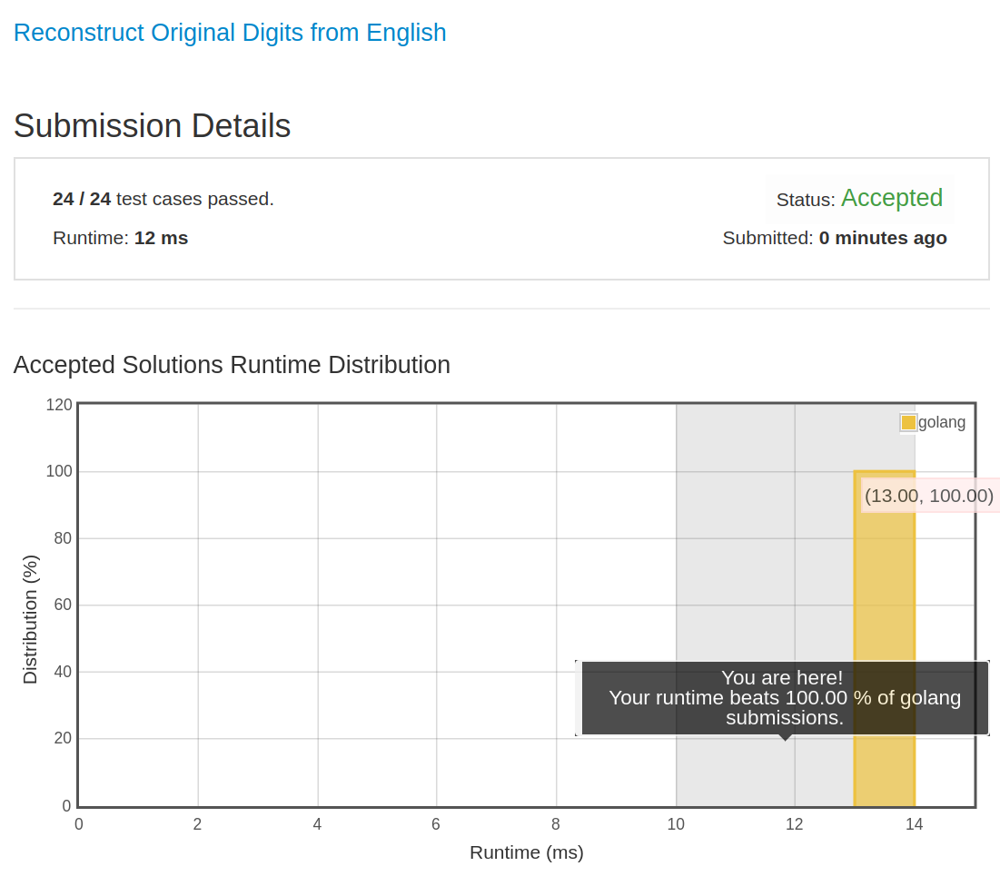

# [423. Reconstruct Original Digits from English](https://leetcode.com/problems/reconstruct-original-digits-from-english/)

## 题目

Given a non-empty string containing an out-of-order English representation of digits 0-9, output the digits in ascending order.

Note:

1. Input contains only lowercase English letters.
1. Input is guaranteed to be valid and can be transformed to its original digits. That means invalid inputs such as "abc" or "zerone" are not permitted.
1. Input length is less than 50,000.

Example 1:

```text
Input: "owoztneoer"

Output: "012"
```

Example 2:

```text
Input: "fviefuro"

Output: "45"
```

## 解题思路

见程序注释

