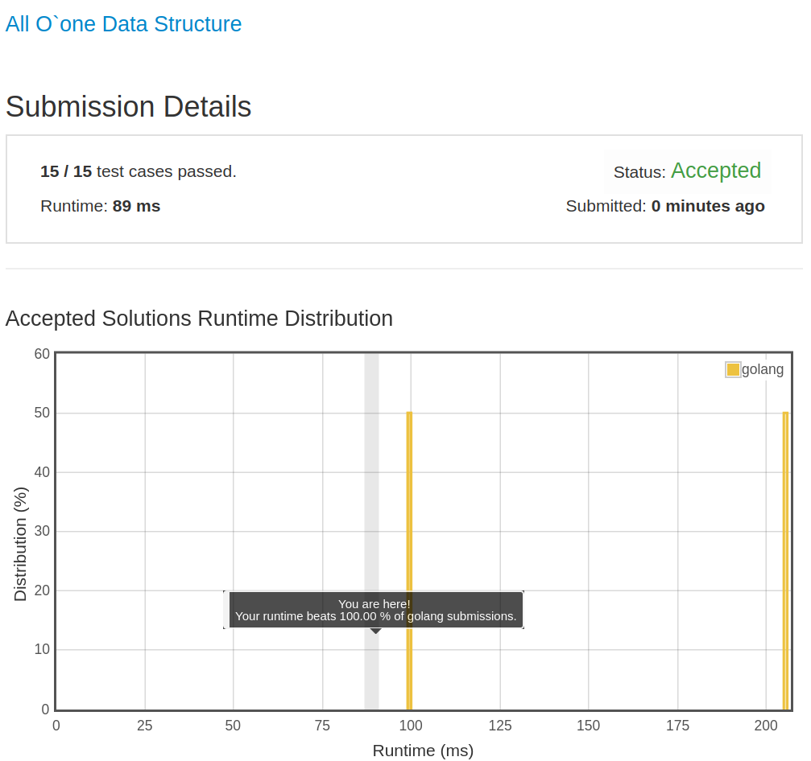

# [432. All O`one Data Structure](https://leetcode.com/problems/all-oone-data-structure/)

## 题目

Implement a data structure supporting the following operations:

1. Inc(Key) - Inserts a new key  with value 1. Or increments an existing key by 1. Key is guaranteed to be a non-empty string.
1. Dec(Key) - If Key's value is 1, remove it from the data structure. Otherwise decrements an existing key by 1. If the key does not exist, this function does nothing. Key is guaranteed to be a non-empty string.
1. GetMaxKey() - Returns one of the keys with maximal value. If no element exists, return an empty string "".
1. GetMinKey() - Returns one of the keys with minimal value. If no element exists, return an empty string "".

Challenge: Perform all these in O(1) time complexity.

## 解题思路

见程序注释
