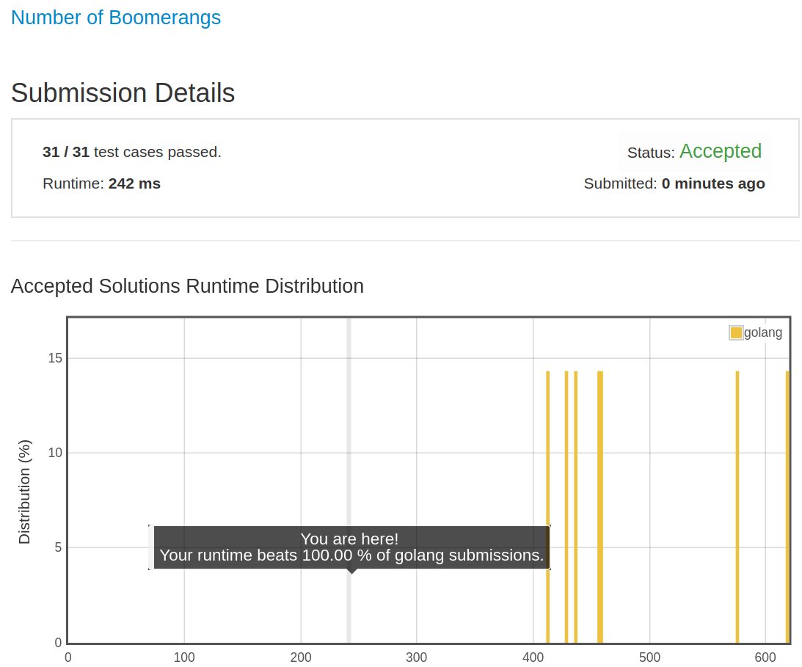

# [447. Number of Boomerangs](https://leetcode.com/problems/number-of-boomerangs/)

## 题目

Given n points in the plane that are all pairwise distinct, a "boomerang" is a tuple of points (i, j, k) such that the distance between i and j equals the distance between i and k (the order of the tuple matters).

Find the number of boomerangs. You may assume that n will be at most 500 and coordinates of points are all in the range [-10000, 10000] (inclusive).

Example:

```text
Input:
[[0,0],[1,0],[2,0]]

Output:
2

Explanation:
The two boomerangs are [[1,0],[0,0],[2,0]] and [[1,0],[2,0],[0,0]]
```

## 解题思路

见程序注释

只是预先指定了 map 的 cap 而已。
