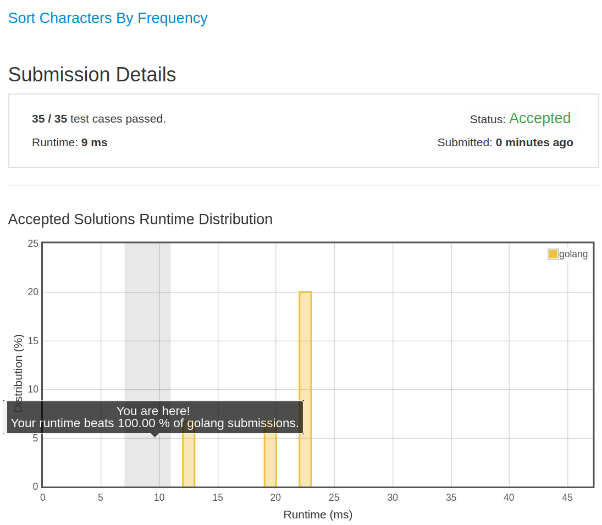

# [451. Sort Characters By Frequency](https://leetcode.com/problems/sort-characters-by-frequency/)

## 题目

Given a string, sort it in decreasing order based on the frequency of characters.

Example 1:

```text
Input:
"tree"

Output:
"eert"

Explanation:
'e' appears twice while 'r' and 't' both appear once.
So 'e' must appear before both 'r' and 't'. Therefore "eetr" is also a valid answer.
```

Example 2:

```text
Input:
"cccaaa"

Output:
"cccaaa"

Explanation:
Both 'c' and 'a' appear three times, so "aaaccc" is also a valid answer.
Note that "cacaca" is incorrect, as the same characters must be together.
```

Example 3:

```text
Input:
"Aabb"

Output:
"bbAa"

Explanation:
"bbaA" is also a valid answer, but "Aabb" is incorrect.
Note that 'A' and 'a' are treated as two different characters.
```

## 解题思路

见程序注释

