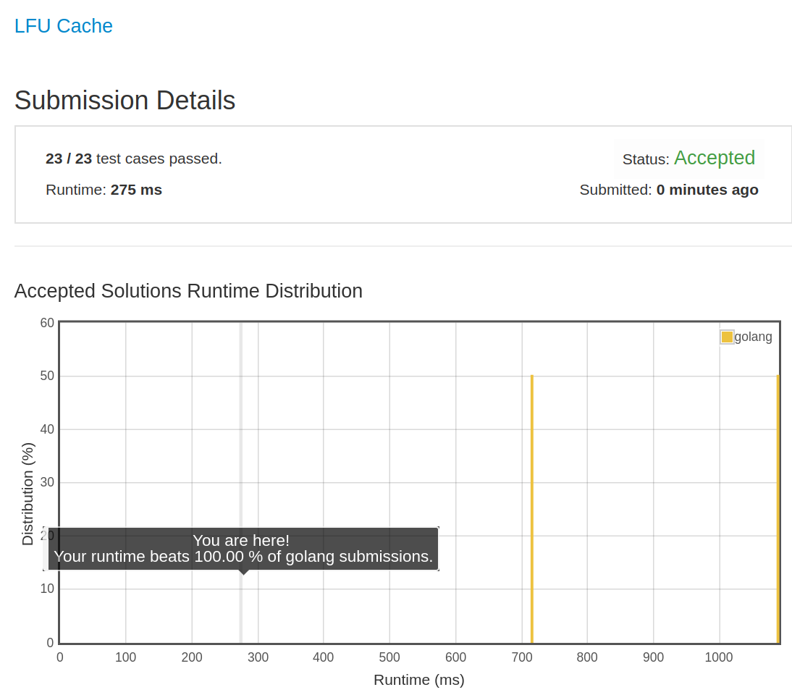

# [460. LFU Cache](https://leetcode.com/problems/lfu-cache/)

## 题目

Design and implement a data structure for [Least Frequently Used (LFU)](https://en.wikipedia.org/wiki/Least_frequently_used) cache.

It should support the following operations: `get` and `put`.

- `get(key)` - Get the value (will always be positive) of the key if the key exists in the cache, otherwise return -1.

- `put(key, value)` - Set or insert the value if the key is not already present. When the cache reaches its capacity, it should invalidate the least frequently used item before inserting a new item. For the purpose of this problem, when there is a tie (i.e., two or more keys that have the same frequency), the least recently used key would be evicted.

Follow up:
Could you do both operations in O(1) time complexity?

Example:

```text
LFUCache cache = new LFUCache( 2 /* capacity */ );

cache.put(1, 1);
cache.put(2, 2);
cache.get(1);       // returns 1
cache.put(3, 3);    // evicts key 2
cache.get(2);       // returns -1 (not found)
cache.get(3);       // returns 3.
cache.put(4, 4);    // evicts key 1.
cache.get(1);       // returns -1 (not found)
cache.get(3);       // returns 3
cache.get(4);       // returns 4
```

## 解题思路

见程序注释

