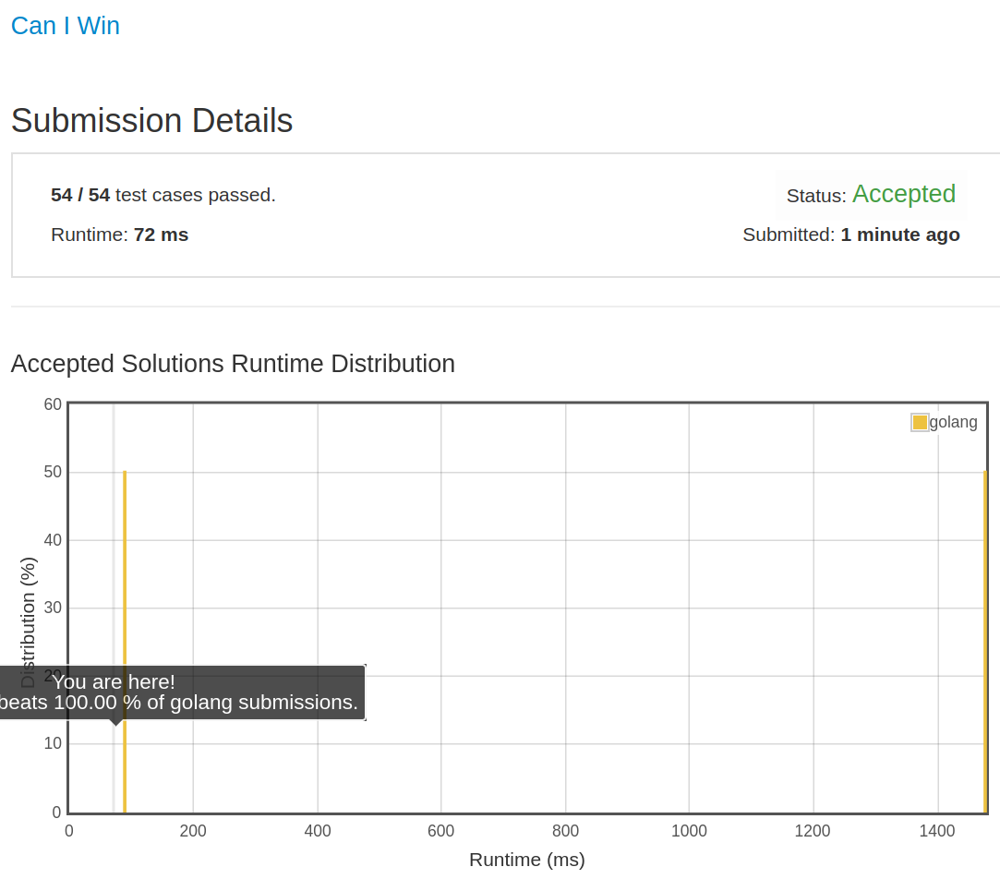

# [464. Can I Win](https://leetcode.com/problems/can-i-win/)

## 题目

In the "100 game," two players take turns adding, to a running total, any integer from 1..10. The player who first causes the running total to reach or exceed 100 wins.

What if we change the game so that players cannot re-use integers?

For example, two players might take turns drawing from a common pool of numbers of 1..15 without replacement until they reach a total >= 100.

Given an integer maxChoosableInteger and another integer desiredTotal, determine if the first player to move can force a win, assuming both players play optimally.

You can always assume that maxChoosableInteger will not be larger than 20 and desiredTotal will not be larger than 300.

Example

```text
Input:
maxChoosableInteger = 10
desiredTotal = 11

Output:
false

Explanation:
No matter which integer the first player choose, the first player will lose.
The first player can choose an integer from 1 up to 10.
If the first player choose 1, the second player can only choose integers from 2 up to 10.
The second player will win by choosing 10 and get a total = 11, which is >= desiredTotal.
Same with other integers chosen by the first player, the second player will always win.
```

## 解题思路

见程序注释

