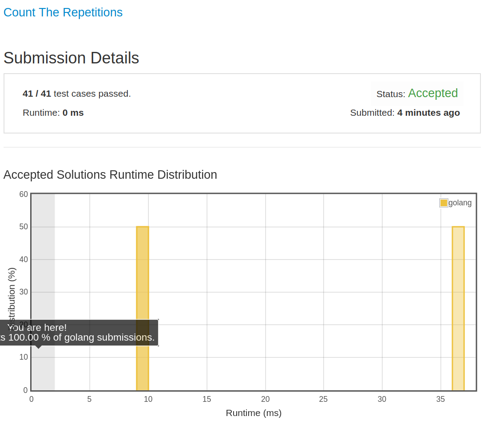

# [466. Count The Repetitions](https://leetcode.com/problems/count-the-repetitions/)

## 题目

Define `S = [s,n]` as the string S which consists of n connected strings s. For example, `["abc", 3]` ="abcabcabc".

On the other hand, we define that string s1 can be obtained from string s2 if we can remove some characters from s2 such that it becomes s1. For example, “abc”  can be obtained from “abdbec” based on our definition, but it can not be obtained from “acbbe”.

You are given two non-empty strings s1 and s2 (each at most 100 characters long) and two integers 0 ≤ n1 ≤ 106 and 1 ≤ n2 ≤ 106. Now consider the strings S1 and S2, where S1=[s1,n1] and S2=[s2,n2]. Find the maximum integer M such that [S2,M] can be obtained from S1.

Example:

```text
Input:
s1="acb", n1=4
s2="ab", n2=2

Return:
2
```

## 解题思路

见程序注释

