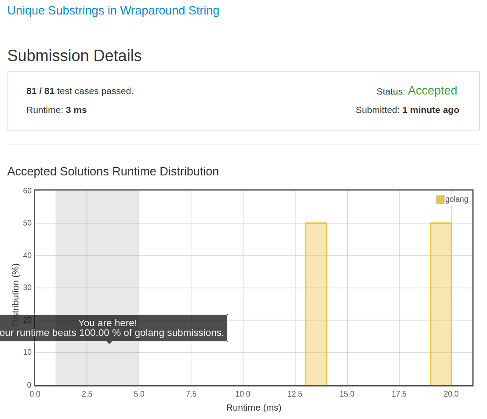

# [467. Unique Substrings in Wraparound String](https://leetcode.com/problems/unique-substrings-in-wraparound-string/)

## 题目

Consider the string s to be the infinite wraparound string of "abcdefghijklmnopqrstuvwxyz", so s will look like this: "...zabcdefghijklmnopqrstuvwxyzabcdefghijklmnopqrstuvwxyzabcd....".

Now we have another string p. Your job is to find out how many unique non-empty substrings of p are present in s. In particular, your input is the string p and you need to output the number of different non-empty substrings of p in the string s.

Note: p consists of only lowercase English letters and the size of p might be over 10000.

Example 1:

```text
Input: "a"
Output: 1

Explanation: Only the substring "a" of string "a" is in the string s.
```

Example 2:

```text
Input: "cac"
Output: 2
Explanation: There are two substrings "a", "c" of string "cac" in the string s.
```

Example 3:

```text
Input: "zab"
Output: 6
Explanation: There are six substrings "z", "a", "b", "za", "ab", "zab" of string "zab" in the string s.
```

## 解题思路

见程序注释

