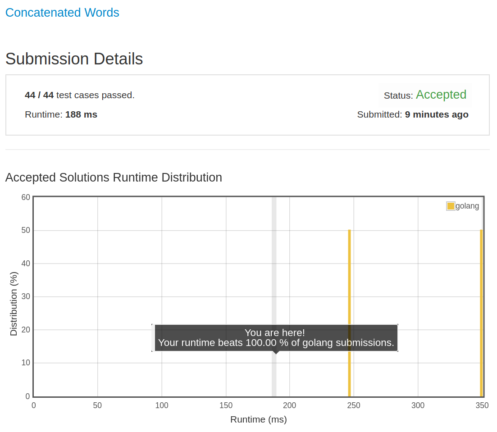

# [472. Concatenated Words](https://leetcode.com/problems/concatenated-words/)

## 题目

Given a list of words (without duplicates), please write a program that returns all concatenated words in the given list of words.

A concatenated word is defined as a string that is comprised entirely of at least two shorter words in the given array.

Example:

```text
Input: ["cat","cats","catsdogcats","dog","dogcatsdog","hippopotamuses","rat","ratcatdogcat"]

Output: ["catsdogcats","dogcatsdog","ratcatdogcat"]

Explanation: "catsdogcats" can be concatenated by "cats", "dog" and "cats";  "dogcatsdog" can be concatenated by "dog", "cats" and "dog"; "ratcatdogcat" can be concatenated by "rat", "cat", "dog" and "cat".
```

Note:

1. The number of elements of the given array will not exceed 10,000
1. The length sum of elements in the given array will not exceed 600,000.
1. All the input string will only include lower case letters.
1. The returned elements order does not matter.

## 解题思路

见程序注释

