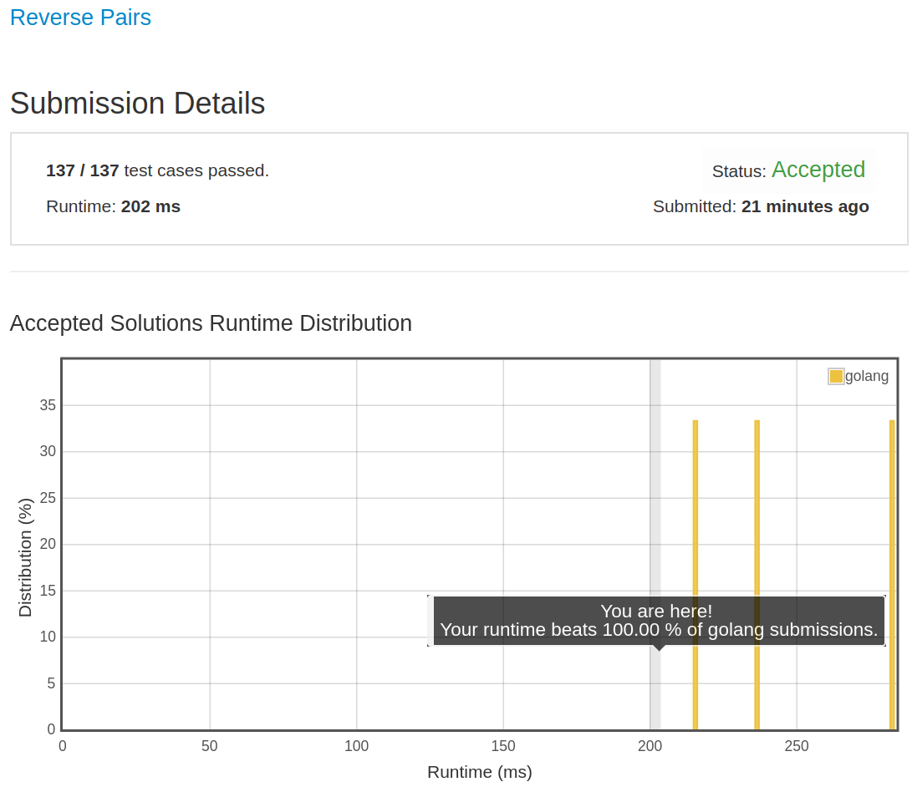

# [493. Reverse Pairs](https://leetcode.com/problems/reverse-pairs/)

## 题目

Given an array nums, we call (i, j) an important reverse pair if i < j and nums[i] > 2*nums[j].

You need to return the number of important reverse pairs in the given array.

Example1:

```text
Input: [1,3,2,3,1]
Output: 2
```

Example2:

```text
Input: [2,4,3,5,1]
Output: 3
```

Note:

1. The length of the given array will not exceed 50,000.
1. All the numbers in the input array are in the range of 32-bit integer.

## 解题思路

见程序注释

