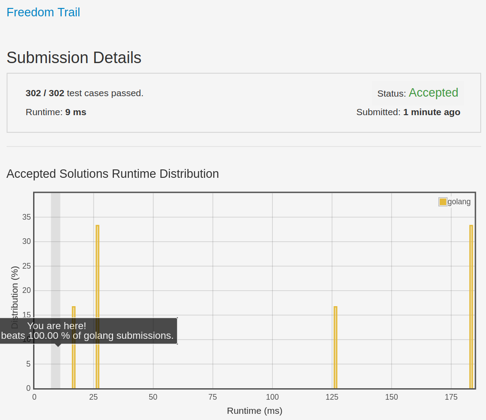

# [514. Freedom Trail](https://leetcode.com/problems/freedom-trail/)

## 题目

In the video game Fallout 4, the quest "Road to Freedom" requires players to reach a metal dial called the "Freedom Trail Ring", and use the dial to spell a specific keyword in order to open the door.

Given a string ring, which represents the code engraved on the outer ring and another string key, which represents the keyword needs to be spelled. You need to find the minimum number of steps in order to spell all the characters in the keyword.

Initially, the first character of the ring is aligned at 12:00 direction. You need to spell all the characters in the string key one by one by rotating the ring clockwise or anticlockwise to make each character of the string key aligned at 12:00 direction and then by pressing the center button.

At the stage of rotating the ring to spell the key character key[i]:

1. You can rotate the ring clockwise or anticlockwise one place, which counts as 1 step. The final purpose of the rotation is to align one of the string ring's characters at the 12:00 direction, where this character must equal to the character key[i].
1. If the character key[i] has been aligned at the 11:00 direction, you need to press the center button to spell, which also counts as 1 step. After the pressing, you could begin to spell the next character in the key (next stage), otherwise, you've finished all the spelling.

Example:


```text
Input: ring = "godding", key = "gd"
Output: 4
Explanation: For the first key character 'g', since it is already in place, we just need 1 step to spell this character.  For the second key character 'd', we need to rotate the ring "godding" anticlockwise by two steps to make it become "ddinggo". Also, we need 1 more step for spelling. So the final output is 4.
```

Note:

1. Length of both ring and key will be in range 1 to 100.
1. There are only lowercase letters in both strings and might be some duplcate characters in both strings.
1. It's guaranteed that string key could always be spelled by rotating the string ring.

## 解题思路

见程序注释

