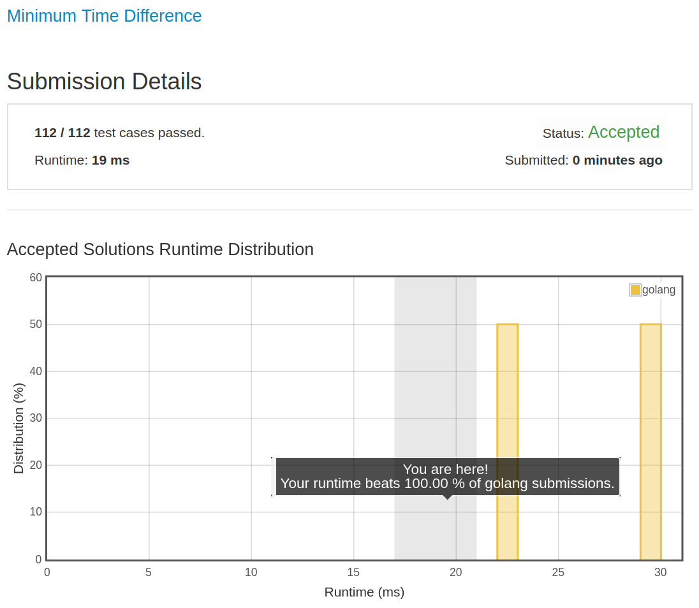

# [539. Minimum Time Difference](https://leetcode.com/problems/minimum-time-difference/)

## 题目

Given a list of 24-hour clock time points in "Hour:Minutes" format, find the minimum minutes difference between any two time points in the list. 

Example 1:

```text
Input: ["23:59","00:00"]
Output: 1
```

Note:

1. The number of time points in the given list is at least 2 and won't exceed 20000.
1. The input time is legal and ranges from 00:00 to 23:59.

## 解题思路

见程序注释

