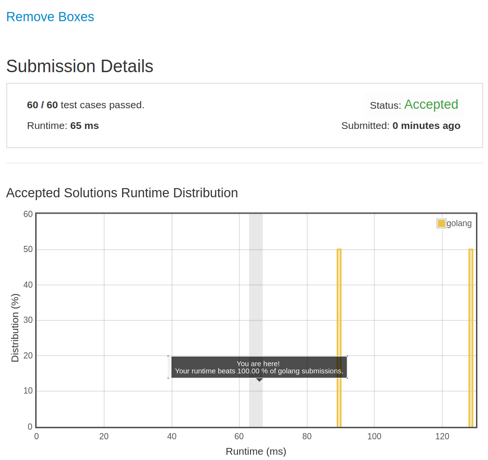

# [546. Remove Boxes](https://leetcode.com/problems/remove-boxes/)

## 题目

Given several boxes with different colors represented by different positive numbers.
You may experience several rounds to remove boxes until there is no box left. Each time you can choose some continuous boxes with the same color (composed of k boxes, k >= 1), remove them and get k*k points.
Find the maximum points you can get.

Example 1:

```text
Input:
[1, 3, 2, 2, 2, 3, 4, 3, 1]

Output:
23

Explanation:
[1, 3, 2, 2, 2, 3, 4, 3, 1]
----> [1, 3, 3, 4, 3, 1] (3*3=9 points)
----> [1, 3, 3, 3, 1] (1*1=1 points)
----> [1, 1] (3*3=9 points)
----> [] (2*2=4 points)
```

Note:
The number of boxes n would not exceed 100.

## 解题思路

见程序注释

