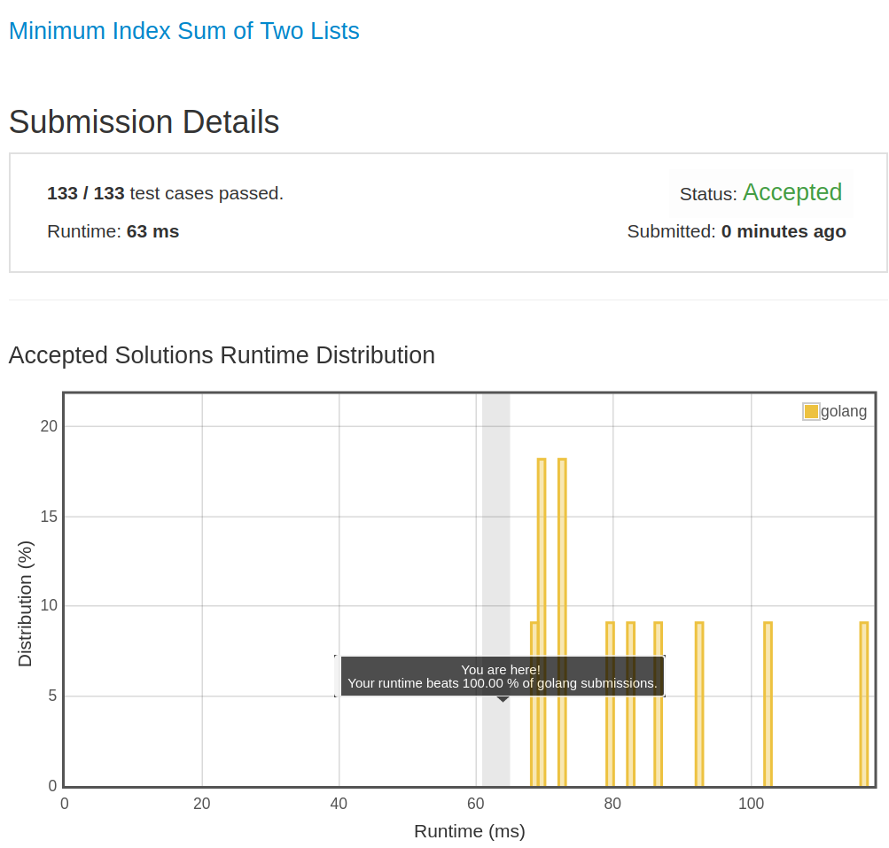

# [599. Minimum Index Sum of Two Lists](https://leetcode.com/problems/minimum-index-sum-of-two-lists/)

## 题目

Suppose Andy and Doris want to choose a restaurant for dinner, and they both have a list of favorite restaurants represented by strings.

You need to help them find out their common interest with the least list index sum. If there is a choice tie between answers, output all of them with no order requirement. You could assume there always exists an answer.

Example 1:

```text
Input:
["Shogun", "Tapioca Express", "Burger King", "KFC"]
["Piatti", "The Grill at Torrey Pines", "Hungry Hunter Steakhouse", "Shogun"]
Output: ["Shogun"]
Explanation: The only restaurant they both like is "Shogun".
```

Example 2:

```text
Input:
["Shogun", "Tapioca Express", "Burger King", "KFC"]
["KFC", "Shogun", "Burger King"]
Output: ["Shogun"]
Explanation: The restaurant they both like and have the least index sum is "Shogun" with index sum 1 (0+1).
```

Note:

1. The length of both lists will be in the range of [1, 1000].
1. The length of strings in both lists will be in the range of [1, 30].
1. The index is starting from 0 to the list length minus 1.
1. No duplicates in both lists.

## 解题思路

见程序注释

