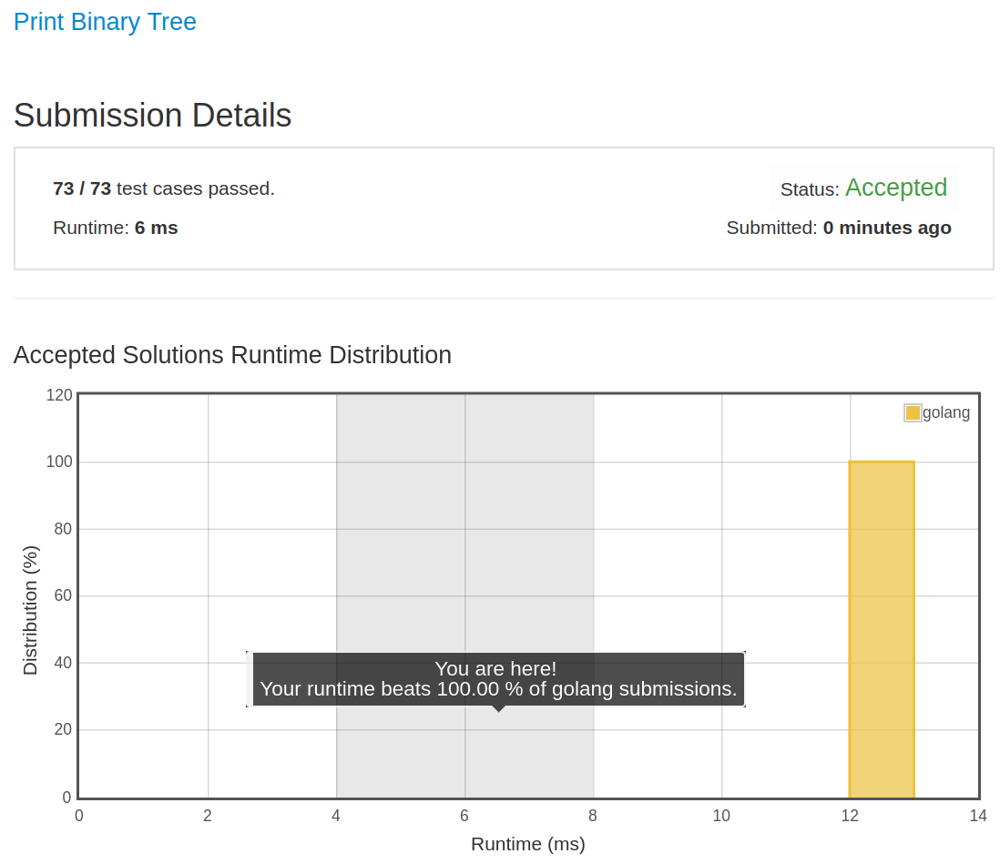

# [655. Print Binary Tree](https://leetcode.com/problems/print-binary-tree/)

## 题目

Print a binary tree in an m*n 2D string array following these rules:

1. The row number m should be equal to the height of the given binary tree.
1. The column number n should always be an odd number.
1. The root node's value (in string format) should be put in the exactly middle of the first row it can be put. The column and the row where the root node belongs will separate the rest space into two parts (left-bottom part and right-bottom part). You should print the left subtree in the left-bottom part and print the right subtree in the right-bottom part. The left-bottom part and the right-bottom part should have the same size. Even if one subtree is none while the other is not, you don't need to print anything for the none subtree but still need to leave the space as large as that for the other subtree. However, if two subtrees are none, then you don't need to leave space for both of them.
1. Each unused space should contain an empty string "".
1. Print the subtrees following the same rules.

Example 1:

```text
Input:
     1
    /
   2
Output:
[["", "1", ""],
 ["2", "", ""]]
```

Example 2:

```text
Input:
     1
    / \
   2   3
    \
     4
Output:
[["", "", "", "1", "", "", ""],
 ["", "2", "", "", "", "3", ""],
 ["", "", "4", "", "", "", ""]]
```

Example 3:

```text
Input:
      1
     / \
    2   5
   /
  3
 /
4
Output:

[["",  "",  "", "",  "", "", "", "1", "",  "",  "",  "",  "", "", ""]
 ["",  "",  "", "2", "", "", "", "",  "",  "",  "",  "5", "", "", ""]
 ["",  "3", "", "",  "", "", "", "",  "",  "",  "",  "",  "", "", ""]
 ["4", "",  "", "",  "", "", "", "",  "",  "",  "",  "",  "", "", ""]]
```

Note: The height of binary tree is in the range of [1, 10].

## 解题思路

见程序注释

