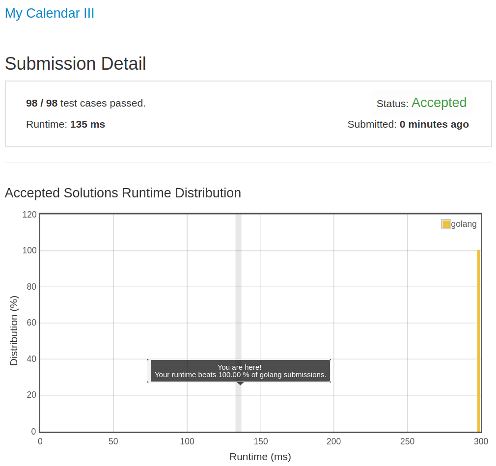

# [732. My Calendar III](https://leetcode.com/problems/my-calendar-iii/)

## 题目

Implement a MyCalendarThree class to store your events. A new event can always be added.

Your class will have one method, book(int start, int end). Formally, this represents a booking on the half open interval [start, end), the range of real numbers x such that start <= x < end.

A K-booking happens when K events have some non-empty intersection (ie., there is some time that is common to all K events.)

For each call to the method MyCalendar.book, return an integer K representing the largest integer such that there exists a K-booking in the calendar.

Your class will be called like this: MyCalendarThree cal = new MyCalendarThree(); MyCalendarThree.book(start, end)

Example 1:

```text
MyCalendarThree();
MyCalendarThree.book(10, 20); // returns 1
MyCalendarThree.book(50, 60); // returns 1
MyCalendarThree.book(10, 40); // returns 2
MyCalendarThree.book(5, 15); // returns 3
MyCalendarThree.book(5, 10); // returns 3
MyCalendarThree.book(25, 55); // returns 3
Explanation:
The first two events can be booked and are disjoint, so the maximum K-booking is a 1-booking.
The third event [10, 40) intersects the first event, and the maximum K-booking is a 2-booking.
The remaining events cause the maximum K-booking to be only a 3-booking.
Note that the last event locally causes a 2-booking, but the answer is still 3 because
eg. [10, 20), [10, 40), and [5, 15) are still triple booked.
```

Note:

- The number of calls to MyCalendarThree.book per test case will be at most 400.
- In calls to MyCalendarThree.book(start, end), start and end are integers in the range [0, 10^9].

## 解题思路

见程序注释

